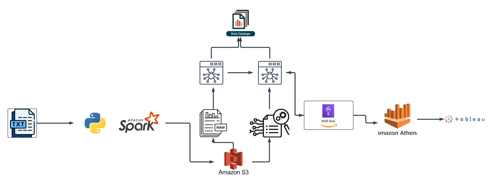

# Unstructured Data Streaming Pipeline Project with Apache Spark and AWS

## Summary

The goal of this project is to design a robust solution program to process unstructured data. The project utilizes Apache Spark's structured streaming capabilities to process the unstructured text data in real-time and extracts relevant information from the text file. 
The extracted information is then stored in the AWS S3 Bucket in a parquet format. AWS Crawler is used for schema inference, data catalog, and management of the data stored in the S3 bucket. Lastly utilized AWS Athena for SQL based querying and checking on the structured data output

## Architecture

## Technology Used
- Programming Language - Python
- Apache Spark
- AWS S3 Bucket
- AWS Glue
- AWS Athena
